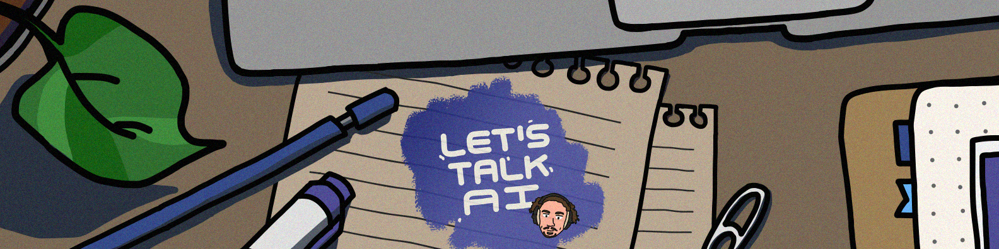
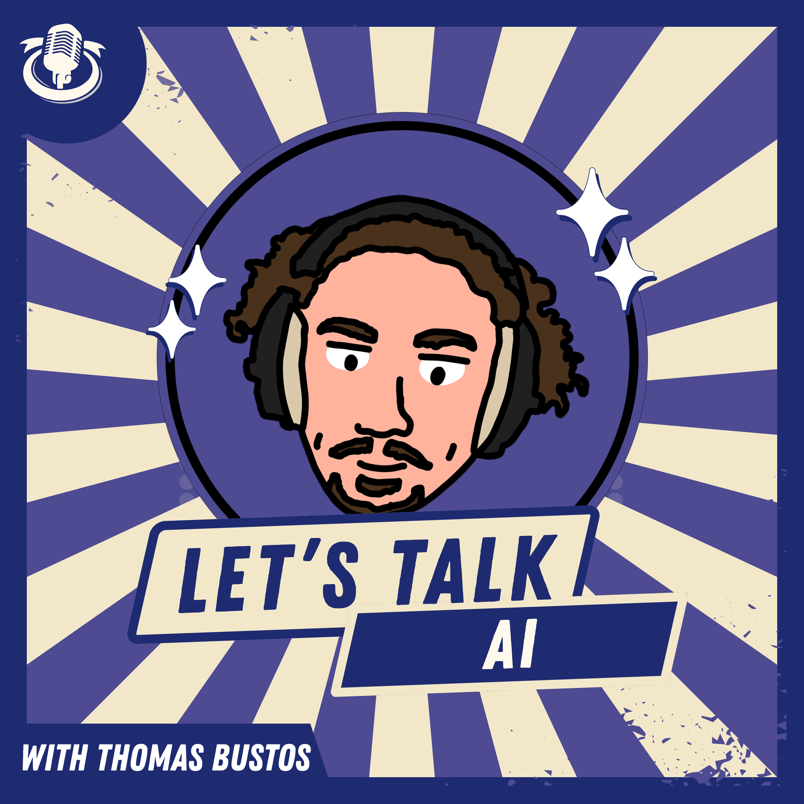

# Thomas Bustos

**`Cooking @ Supernal | Co-founder & advisor @ Lyah | Let's Talk AI & AI Native Club`**

 

-----

## What I do

- **Cooking @ [Supernal](https://getsupernal.ai/)**
- **Co-founder & advisor @ [Lyah](http://lyah.ai/)**
- **Host [Let's Talk AI](https://www.youtube.com/@lets-talk-ai/)**
- **[AI Native Club](https://ainativeclub.com)**
- **Mission:** Build exceptional products with exceptional people. Document everything along the way.

## Socials

## My Latest Open Source Projects

<table>
  <tr>
    <td width="50%">
      <h3><a href="https://github.com/ThoBustos/openyoko">openyoko</a></h3>
      
      
Personal Agent OS. My operating system for life, built on Obsidian.

    </td>
    <td width="50%">
      <h3><a href="https://github.com/ThoBustos/ainativeclub">ainativeclub</a></h3>
      
      
The club for AI-native builders. Landing + member portal.

    </td>
  </tr>
  <tr>
    <td width="50%">
      <h3><a href="https://github.com/ThoBustos/reader">reader</a></h3>
      
      
Custom tool to read and annotate research papers.

    </td>
    <td width="50%">
      <h3><a href="https://github.com/ThoBustos/quizz-mcp">quizz-mcp</a></h3>
      
      
MCP that quizzes me while deep in tmux + Claude Code.

    </td>
  </tr>
</table>

## Let's Talk AI Podcast

<table>
  <tr>
    <td width="30%">
      
    </td>
    <td width="70%">
      

        <h2>Host of "Let's Talk AI"</h2>
        
Weekly conversations with AI builders, founders, and tech leaders. We dive deep into what they're building, how they think, and the lessons they've learned.

        
<strong>Listen on:</strong> <a href="https://www.youtube.com/@lets-talk-ai">YouTube</a> | <a href="https://open.spotify.com/show/6mVjFvdEkZDCTXpIuuSLAP">Spotify</a> | <a href="https://podcasts.apple.com/us/podcast/lets-talk-ai/id1661094909">Apple Podcasts</a> | Available on all major podcast platforms

      

    </td>
  </tr>
</table>

## Tech Stack

**Languages:** Python, PySpark, SQL, React, Vue.js, Next.js, TypeScript  
**Backend:** FastAPI, Django, Flask  
**Cloud & Data:** GCP, Azure, AWS, Databricks, Kubernetes, Medallion Architecture  
**AI & ML:** OPIK, LangGraph, MLOps, LLMOps, Langchain, Crew AI, RAG & Agents, AI Chatbots, Predictive Analytics, MLflow  
**DevOps:** Docker, Terraform, CI/CD, Real-Time Systems (Confluent Kafka)

## Favorite Frameworks & Books

**Frameworks:** Lean & Bullseye  
**Favorite books (share yours):**
- The Lean Product Playbook – Dan Olsen
- Traction: A Startup Guide to Getting Customers – Gabriel Weinberg & Justin Mares
- Principles – Ray Dalio
- Sell More Faster: The Ultimate Sales Playbook for Startups – Amos Schwartzfarb
- [Check my full collection of books](https://www.thomasbustos.com/library)

## Certifications

- Databricks Champion
- Databricks ML & Data Engineering (Professional)
- Azure Data Engineering
- not doing certifications anymore, I prefer to directly build and learn by doing

## Building something cool?

I’d love to hear about it. Reach out on [LinkedIn](https://www.linkedin.com/in/thomasbustos/) or [X](https://x.com/ThoBustos).

-----

*Languages: English, French, Spanish*

## Cool People to Follow

**Paul Iusztin** - Senior AI/ML Engineer • Founder @ Decoding ML ~ Articles and courses about building production-grade AI systems.  

**Miguel Otero Pedrido** - Physicist & ML Engineer focused on building ML systems that work in production. Shares his journey and helps others break into the field.  

